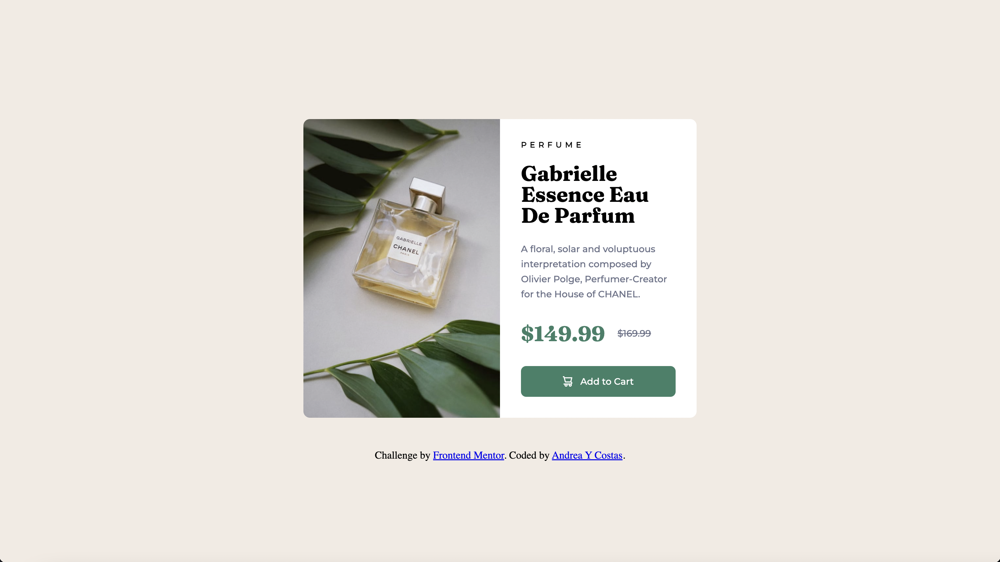

# Frontend Mentor - Product preview card component solution

This is a solution to the [Product preview card component challenge on Frontend Mentor](https://www.frontendmentor.io/challenges/product-preview-card-component-GO7UmttRfa). Frontend Mentor challenges help you improve your coding skills by building realistic projects.

## Table of contents

- [Overview](#overview)
  - [The challenge](#the-challenge)
  - [Screenshot](#screenshot)
  - [Links](#links)
- [My process](#my-process)
  - [Built with](#built-with)
  - [What I learned](#what-i-learned)
  - [Continued development](#continued-development)
- [Author](#author)

## Overview

### The challenge

Users should be able to:

- View the optimal layout depending on their device's screen size
- See hover and focus states for interactive elements

### Screenshot

### Links

- Solution URL: [Solution](https://www.frontendmentor.io/solutions/responsive-product-preview-card-component-mqsfrnqjQU)
- Live Site URL: [Live site](https://a-costas.github.io/FrontendMentor-Product-Preview-Card/)

## My process

### Built with

- Semantic HTML5 markup
- CSS custom properties
- CSS Reset
- Flexbox
- CSS Grid
- Mobile-first workflow

### What I learned

The main thing I learned is the importance of CSS reset to maintaining your sanity during development. Additionally, how to use the <picture> tags, and getting into a mindset of mobile-first development.

### Continued development

I want to continue practicing having a mobile-first workflow as well as writing accessible code.

## Author

- Andrea Y Costas
- Frontend Mentor - [@a-costas](https://www.frontendmentor.io/profile/a-costas)
